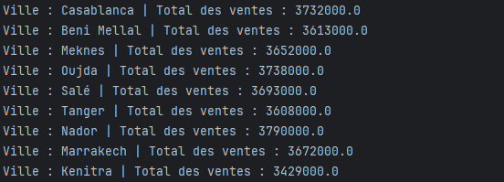
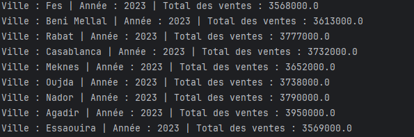

<h1> Application 1 — Total des ventes par ville </h1>

<h3>Description</h3>

Cette application lit le fichier ventes.txt et calcule le total des ventes par ville, 
toutes années confondues.

<h3>Fonctionnement</h3>
<pre>
- Ignorer la ligne d’en-tête.

- Extraire la ville et le prix.

- Regrouper les ventes par ville.

- Calculer le total pour chaque ville.
</pre>
<h3>Exemple de sortie</h3>

<h1> Application 2 — Total des ventes par ville et par année </h1>

<h3>Description</h3>

Cette application lit le même fichier ventes.txt et calcule le total des ventes par ville et par année.

<h3>Fonctionnement</h3>
<pre>
- Ignorer la ligne d’en-tête.

- Extraire la ville, l’année (à partir de la date), et le prix.

- Utiliser (ville, année) comme clé.

- Calculer le total pour chaque couple (ville, année).
</pre>
<h3>Exemple de sortie</h3>
